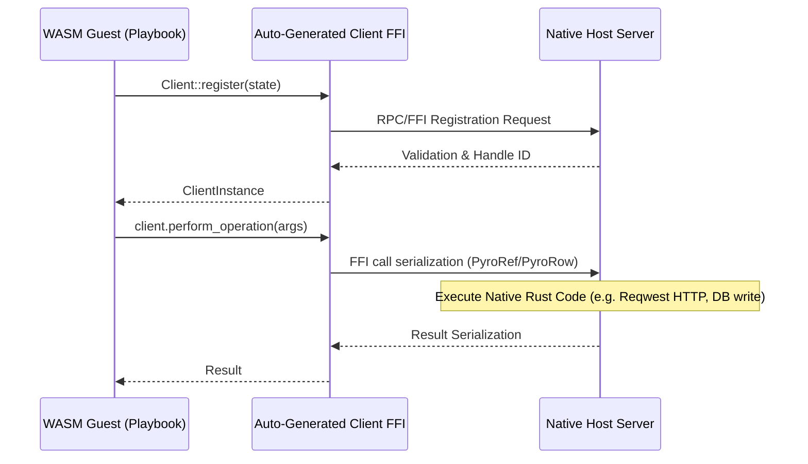

# Guide: Making Host Capabilities for Pyroduct Agents

Welcome to the **Pyroduct Capability Guide**. This document defines the architecture, manifest specs, development workflow, and Rust implementation patterns for **Host Capabilities**.

Capabilities allow sandboxed WebAssembly (WASM) playbooks to securely perform native, host-level actions (such as filesystem access, network HTTP requests, state management, or LLM/RAG querying).

---

## Table of Contents
1. [Overview & Capability FFI Architecture](#1-overview--capability-ffi-architecture)
2. [Capability Project Structure](#2-capability-project-structure)
3. [Manifest Specification (`Capability.toml`)](#3-manifest-specification-capabilitytoml)
4. [Writing a Capability in Rust](#4-writing-a-capability-in-rust)
5. [Compiling & Packaging Capabilities](#5-compiling--packaging-capabilities)
6. [Complete Capability Example](#6-complete-capability-example)

---

## 1. Overview & Capability FFI Architecture

A **Capability** acts as a bridge between the isolated WebAssembly guest runtime and the native host system. 



### Key Architectural Concepts

*   **Config (`#[pyroduct::config]`)**: Capability-wide startup configuration passed from the daemon/pipeline configuration at instantiation.
*   **Client State (`#[pyroduct::magma]`)**: Client-specific properties declared by the WASM guest, serialized and passed across the FFI boundary on registration.
*   **Server (`#[pyroduct::capability]`)**: The native host server struct that handles incoming RPC requests, manages long-lived connections, and interacts with native APIs.

---

## 2. Capability Project Structure

A capability is structured as a Cargo library containing a manifest (`Capability.toml`) and source files:

```text
my_capability/
├── Capability.toml        # Manifest defining metadata and target dependencies
├── src/
│   └── lib.rs             # Client state, configuration, and server implementation
└── Cargo.toml             # Auto-generated by Pyroduct during compilation
```

> [!WARNING]
> Do not modify `Cargo.toml` manually. Pyroduct uses `Capability.toml` as the single source of truth and generates/overwrites `Cargo.toml` automatically when building.

---

## 3. Manifest Specification (`Capability.toml`)

The [Capability.toml](file:///Users/sven/nbhd/pyroduct/capabilities/config/Capability.toml) manifest defines library metadata and targets. Since capability code compiles to *both* host native targets and WASM targets, dependencies are partitioned into distinct sections:

| Manifest Section | Compile Target | Description |
| :--- | :--- | :--- |
| `[dependencies.host]` | **Host Native** | Dependencies only compiled into the native side (e.g. `reqwest`, `tokio`, or dynamic libraries). |
| `[dependencies.module]` | **WASM Guest** | Dependencies only compiled into the WASM client side (e.g. lightweight utility crates). |
| `[dependencies.shared]` | **Both** | Common dependencies needed by both WASM clients and Host servers (e.g. `serde`). |

### Example Manifest

```toml
[capability]
name = "http_client"
version = "0.1.0"
edition = "2024"
authors = ["agent-alpha"]

[pyroduct]
path = "../../lib/pyroduct"

[dependencies.host]
reqwest = { version = "0.11", features = ["json"] }
tokio = { version = "1.0", features = ["full"] }

[dependencies.module]

[dependencies.shared]
serde = { version = "1.0", features = ["derive"] }
```

---

## 4. Writing a Capability in Rust

Writing a capability involves three distinct steps in [src/lib.rs](file:///Users/sven/nbhd/pyroduct/capabilities/config/src/lib.rs):

### 1. Declare client configuration (Optional)
This struct represents settings parsed from the global pipeline config (e.g. API keys or base URLs).
```rust
#[pyroduct::config]
pub struct HttpConfig {
    pub base_url: String,
    pub timeout_seconds: u64,
}
```

### 2. Declare client state (`#[pyroduct::magma]`)
This struct contains parameters provided by the playbook at registration (e.g. authorization headers, user sessions).
```rust
#[pyroduct::magma]
pub struct HttpClient {
    pub auth_token: String,
}
```

### 3. Implement Server and Lifecycle Methods (`#[pyroduct::capability]`)
The main server struct must implement the `#[pyroduct::capability]` macro, defining associated types and key lifecycle handlers:

```rust
pub struct HttpServer {
    base_url: String,
    timeout: std::time::Duration,
}

#[pyroduct::capability]
impl HttpServer {
    type Config = HttpConfig;
    type Client = HttpClient;

    // 1. Lifecycle: Instantiated at daemon/worker startup with optional config
    async fn new(config: Option<HttpConfig>) -> Result<Self, pyroduct::CapturedError> {
        let config = config.unwrap_or(HttpConfig {
            base_url: "https://api.default.org".to_string(),
            timeout_seconds: 30,
        });
        Ok(Self {
            base_url: config.base_url,
            timeout: std::time::Duration::from_secs(config.timeout_seconds),
        })
    }

    // 2. Lifecycle: Resets state between pipeline/session runs
    async fn reset(&mut self) -> Result<(), pyroduct::CapturedError> {
        // Clear caches or connection pools if necessary
        Ok(())
    }

    // 3. Lifecycle: Validates and registers a new client instance
    fn register(&self, client: &HttpClient) -> Result<(), pyroduct::CapturedError> {
        if client.auth_token.is_empty() {
            pyroduct::bail!("Authorization token cannot be empty");
        }
        Ok(())
    }

    // 4. Exposed Methods: MUST take &self, &Client, and return Result<T, pyroduct::CapturedError>
    async fn fetch_data(&self, client: &HttpClient, path: String) -> Result<String, pyroduct::CapturedError> {
        let full_url = format!("{}/{}", self.base_url, path);
        // Make actual native HTTP request using token from client and base_url
        Ok(format!("Mock Response from {} using token {}", full_url, client.auth_token))
    }
}
```

> [!NOTE]
> Pyroduct auto-generates a client trait (`HttpClientMethods`) compiled inside the playbook target. Playbooks invoke capability methods on the client instance directly: `client.fetch_data("v1/users".to_string())?`.

---

## 5. Compiling & Packaging Capabilities

To compile a capability and make it available to the daemon or local runners, use the `pyroduct ship` command:

```bash
# Compile capability, generate Cargo and FFI glue, and place it in the local cache
pyroduct ship path/to/capability_folder
```

This compiles both the WASM-side client library and the host-side dynamic library, publishing the capability metadata and binary into the Pyroduct capability registry cache.

---

## 6. Complete Capability Example

Here is a complete, minimal implementation of a Key-Value storage capability:

### `Capability.toml`
```toml
[capability]
name = "kv_store"
version = "0.1.0"
edition = "2024"
authors = ["agent-alpha"]

[pyroduct]
path = "../../lib/pyroduct"

[dependencies.host]
[dependencies.module]
[dependencies.shared]
```

### `src/lib.rs`
```rust
use std::collections::HashMap;
use std::sync::Mutex;

#[pyroduct::config]
pub struct KvConfig {
    pub initial_capacity: usize,
}

#[pyroduct::magma]
pub struct KvClient {
    pub namespace: String,
}

pub struct KvServer {
    // Thread-safe in-memory database
    db: Mutex<HashMap<String, String>>,
}

#[pyroduct::capability]
impl KvServer {
    type Config = KvConfig;
    type Client = KvClient;

    async fn new(config: Option<KvConfig>) -> Result<Self, pyroduct::CapturedError> {
        let cap = config.map(|c| c.initial_capacity).unwrap_or(128);
        Ok(Self {
            db: Mutex::new(HashMap::with_capacity(cap)),
        })
    }

    async fn reset(&mut self) -> Result<(), pyroduct::CapturedError> {
        if let Ok(mut store) = self.db.lock() {
            store.clear();
        }
        Ok(())
    }

    fn register(&self, client: &KvClient) -> Result<(), pyroduct::CapturedError> {
        if client.namespace.is_empty() {
            pyroduct::bail!("Namespace must be specified");
        }
        Ok(())
    }

    // Capability storage methods
    fn get(&self, client: &KvClient, key: String) -> Result<Option<String>, pyroduct::CapturedError> {
        let store = self.db.lock().map_err(|_| pyroduct::capture!("Poisoned lock"))?;
        let namespaced_key = format!("{}:{}", client.namespace, key);
        Ok(store.get(&namespaced_key).cloned())
    }

    fn set(&self, client: &KvClient, key: String, value: String) -> Result<(), pyroduct::CapturedError> {
        let mut store = self.db.lock().map_err(|_| pyroduct::capture!("Poisoned lock"))?;
        let namespaced_key = format!("{}:{}", client.namespace, key);
        store.insert(namespaced_key, value);
        Ok(())
    }
}
```

### Playbook Integration Example
To use the newly built `kv_store` capability within a playbook:

```rust
use kv_store::{KvClient, KvClientMethods};

#[pyroduct::module(output = retrieved_value)]
fn call(key: &str) -> Result<String> {
    // 1. Instantiate the Key-Value client state
    let client = KvClient {
        namespace: "users".to_string(),
    }.register()?;

    // 2. Set values via host FFI
    client.set(key.to_string(), "active_status".to_string())?;

    // 3. Retrieve value from host
    let retrieved_value = client.get(key.to_string())?
        .unwrap_or_else(|| "not_found".to_string());

    Ok(retrieved_value)
}
```

---

## Additional References
*   [Playbook Developer Guide](file:///Users/sven/nbhd/pyroduct/guide/PLAYBOOK_GUIDE.md) - Instructions on creating playbooks that consume capabilities.
*   [Core Error Guide](file:///Users/sven/nbhd/pyroduct/lib/pyroduct/errors.md) - Troubleshooting compilation or registration faults.
