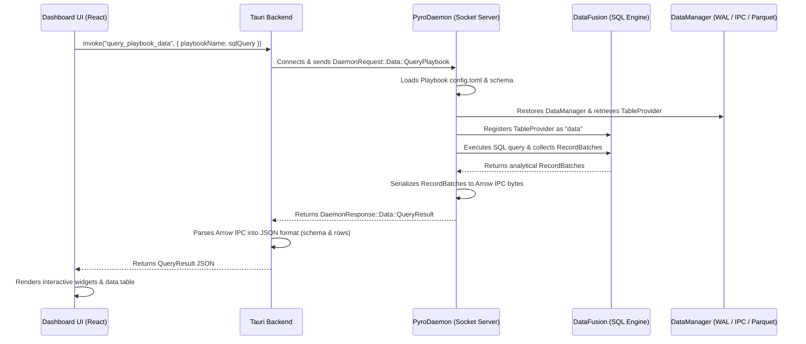

# Querying Playbook Data via Daemon Sockets for Dashboards

This guide explains how dashboard applications (such as the Tauri-based frontend) can execute SQL queries against playbook pipelines using a daemon socket connection to populate interactive dashboards.

## System Architecture

The following diagram illustrates how the Dashboard UI, Tauri backend, PyroDaemon socket server, and DataFusion query engine interact:



---

## 1. Daemon Socket Connections

`pyro-daemond` establishes a control socket to listen for incoming client commands. Depending on the environment configuration, this socket can either be a Unix Domain Socket (UDS) or a TCP socket:

- **Unix Domain Socket (UDS)**:
  - **macOS**: Located at `~/.pyroduct/control` (configured by [install.sh](file:///Users/sven/nbhd/pyroduct/install.sh)) or legacy macOS `~/Library/Application Support/pyro-daemon/control`.
  - **Linux**: Located at `/var/lib/pyro-daemon/control`.
- **TCP Socket**:
  - Bound via the `--bind-tcp` command-line argument (e.g., `127.0.0.1:9000`).

The listening server is implemented in [lib/pyro-daemon/src/server.rs](file:///Users/sven/nbhd/pyro-daemon/src/server.rs) using `PyroListener` and `PyroSocket`.

---

## 2. Communication Protocol (RPC)

Clients send messages serialized in a framing format using JSON payloads. To execute a SQL query on a playbook, the client triggers the `query_playbook` method on the daemon.

### Request Payload (`DaemonRequest`)

A `DaemonRequest::Data` request with action `query_playbook` is sent over the socket:

```json
{
  "type": "data",
  "action": "query_playbook",
  "playbook_name": "police_reporting_chatbot",
  "sql_query": "SELECT id, result, status FROM data WHERE status = 'error' LIMIT 10"
}
```

### Response Payload (`DaemonResponse`)

The daemon replies with a `DaemonResponse::Data` containing the Arrow IPC serialized bytes:

```json
{
  "status": "query_result",
  "ipc_bytes": [137, 65, 82, 82, 79, 87, 49, 0, 0, 0, ...]
}
```

> [!NOTE]
> **Why Arrow IPC?**
> Returning Apache Arrow IPC bytes instead of raw JSON allows high-performance analytical queries. Type definitions, schema details, and binary data buffers are preserved efficiently without incurring massive JSON serialization overhead over the socket connection.

---

## 3. Daemon-Side SQL Execution (DataFusion)

When the daemon receives a `QueryPlaybook` request (handled in [lib/pyro-daemon/src/data/sql.rs](file:///Users/sven/nbhd/pyroduct/lib/pyro-daemon/src/data/sql.rs)), it performs the following steps:

1. **Locate Playbook Configuration**: Finds `config.toml` under the playbook directory (e.g., `~/.pyroduct/playbooks/{playbook_name}/config.toml`).
2. **Load Output Schema**: Loads the pipeline configuration to determine the output schema of the final step.
3. **Restore DataManager**: Instantiates a `DataManager` for the playbook's output directory. The `DataManager` holds references to the three storage layers:
   - In-memory Write-Ahead Log (WAL) active buffers.
   - Local Arrow IPC files (`.arrow`) in the active reader cache.
   - Rolled-out Apache Parquet files (`.parquet`) for long-term storage.
4. **Get Table Provider**: Requests `DataManager::sql_provider()` to acquire a unified DataFusion `TableProvider`.
5. **Execute in DataFusion**:
   - Registers the `TableProvider` as the table named **`data`** in a new DataFusion `SessionContext`.
   - Executes the query against this context:
     ```rust
     let df = ctx.sql(sql_query).await?;
     let results = df.collect().await?;
     ```
6. **Serialize to Arrow IPC**: Serializes the execution output (`Vec<RecordBatch>`) into the IPC file format using an Arrow `FileWriter`.

---

## 4. Frontend Integration

The dashboard frontend executes SQL queries using Tauri commands that act as a bridge.

### Tauri Command Bridge

Implemented in [lib/pyro-gui/src/commands/data.rs](file:///Users/sven/nbhd/pyroduct/lib/pyro-gui/src/commands/data.rs), the Tauri backend converts binary Arrow IPC bytes into a JSON-friendly `QueryResult`:

```rust
#[tauri::command]
pub async fn query_playbook_data(
    playbook_name: String,
    sql_query: String,
) -> Result<Value, String> {
    let client = connect_to_active_daemon().await?;
    let ipc_bytes = client.query_playbook(playbook_name, sql_query).await?;
    
    if ipc_bytes.is_empty() {
        return Ok(serde_json::json!({ "schema": [], "rows": [] }));
    }

    // Read Arrow batches and construct schema + row arrays
    let mut reader = arrow::ipc::reader::FileReader::try_new(std::io::Cursor::new(ipc_bytes), None)?;
    let mut rows = Vec::new();
    let mut fields = Vec::new();
    let mut first = true;
    
    while let Some(batch_res) = reader.next() {
        let batch = batch_res?;
        if first {
            fields = batch.schema().fields().iter().map(|f| {
                serde_json::json!({
                    "name": f.name(),
                    "type": format!("{:?}", f.data_type()),
                    "nullable": f.is_nullable()
                })
            }).collect();
            first = false;
        }
        
        for i in 0..batch.num_rows() {
            let row = batch.row(i)?;
            rows.push(serde_json::to_value(&row)?);
        }
    }

    Ok(serde_json::json!({ "schema": fields, "rows": rows }))
}
```

### Dashboard UI Component (React & TypeScript)

The UI component (such as [DataExplorer.tsx](file:///Users/sven/nbhd/pyroduct/lib/pyro-gui/ui/src/components/DataExplorer.tsx)) invokes this Tauri command to retrieve data and display it dynamically:

```typescript
import { useState } from "react";
import { invoke } from "@tauri-apps/api/core";

interface QueryResult {
  schema: Array<{ name: string; type: string; nullable: boolean }>;
  rows: Array<Record<string, any>>;
}

export function SqlConsole({ playbookName }: { playbookName: string }) {
  const [sqlQuery, setSqlQuery] = useState("SELECT * FROM data LIMIT 10");
  const [results, setResults] = useState<QueryResult | null>(null);
  const [error, setError] = useState<string | null>(null);

  const handleExecute = async () => {
    setError(null);
    try {
      const res = await invoke("query_playbook_data", {
        playbookName,
        sqlQuery,
      }) as QueryResult;
      setResults(res);
    } catch (err) {
      setError(String(err));
    }
  };

  return (
    <div>
      <textarea value={sqlQuery} onChange={(e) => setSqlQuery(e.target.value)} />
      <button onClick={handleExecute}>Execute Query</button>
      
      {error && <div className="error">{error}</div>}
      
      {results && (
        <table>
          <thead>
            <tr>
              {results.schema.map(field => (
                <th key={field.name}>{field.name}</th>
              ))}
            </tr>
          </thead>
          <tbody>
            {results.rows.map((row, idx) => (
              <tr key={idx}>
                {results.schema.map(field => (
                  <td key={field.name}>{String(row[field.name])}</td>
                ))}
              </tr>
            ))}
          </tbody>
        </table>
      )}
    </div>
  );
}
```

> [!TIP]
> **Performance Tip**
> Since DataFusion automatically indexes/parses target Parquet files and filters records during scanning, using narrow `SELECT` columns and reasonable `LIMIT` clauses will ensure maximum efficiency and visual responsiveness in dashboard components.
