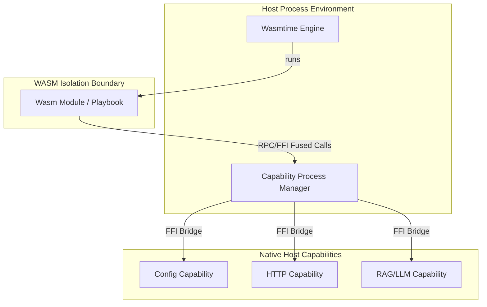

# Guide: Making Playbooks for Pyroduct Agents

Welcome to the **Pyroduct Playbook Guide**. This document defines the architecture, specifications, development workflow, and coding patterns for **Playbooks** (sandboxed WASM modules) within the Pyroduct ecosystem. 

This guide serves as a manual for developers and agents to build, configure, and code playbooks.

---

## Table of Contents
1. [Overview & Sandbox Architecture](#1-overview--sandbox-architecture)
2. [Playbook Project Structure](#2-playbook-project-structure)
3. [Manifest Specification (`Module.toml`)](#3-manifest-specification-moduletoml)
4. [Writing Playbook Logic in Rust](#4-writing-playbook-logic-in-rust)
5. [Building & Packaging Playbooks](#5-building--packaging-playbooks)
6. [Concrete Examples](#6-concrete-examples)

---

## 1. Overview & Sandbox Architecture

In Pyroduct, a **Playbook** is a sandboxed WebAssembly (WASM) module that defines a data-processing step. It communicates with the host environment using structured input/output rows (`PyroRow`) and requests native operations (like HTTP requests, database reads/writes, RAG models, or local state storage) via **Host Capabilities**.



### Key Architectural Concepts

*   **Isolated Sandbox:** Playbooks compile to target `wasm32-wasip1`. They cannot access the filesystem or network directly, ensuring safety.
*   **Structured Interface:** A playbook defines a single, typed entrypoint function marked with the `#[pyroduct::module]` macro. Input and output schemas are inferred or declared.
*   **Fused FFI/RPC Capabilities:** Whenever a playbook needs to perform operations like fetching URLs or querying state databases, it links with a host capability.

---

## 2. Playbook Project Structure

A typical playbook project is structured as a standalone Rust crate, managed by a custom manifest file:

```text
my_playbook/
├── Module.toml            # Pyroduct module manifest (defines metadata & capabilities)
├── src/
│   └── lib.rs             # Playbook entrypoint logic and capability calls
├── artifacts/             # Created during compilation
│   ├── mod.wasm           # Compiled sandboxed WASM binary
│   └── interface.json     # Extracted input/output schema specification
└── Cargo.toml             # Auto-generated by "pyroduct expand" (do not edit manually)
```

> [!WARNING]
> Do not modify `Cargo.toml` manually. Pyroduct uses `Module.toml` as the source of truth and generates/overwrites `Cargo.toml` automatically during the `pyroduct expand` phase.

---

## 3. Manifest Specification (`Module.toml`)

The [Module.toml](file:///Users/sven/nbhd/pyroduct/modules/basic/Module.toml) manifest tells the Pyroduct compiler how to construct the module, what capabilities it requires, and how those capabilities are configured.

### Schema Fields

| Table Section | Key | Type | Description |
| :--- | :--- | :--- | :--- |
| `[module]` | `package` | String | Unique identifier of the playbook. |
| | `version` | String | Semantic version of the playbook (e.g. `0.1.0`). |
| | `author` | String | Name or organization of the author. |
| `[pyroduct]` | `path` | String | Path to the local `pyroduct` engine library folder. |
| `[capabilities]` | `<cap_alias>` | Inline Table | Configuration structure for linked capabilities. |
| `[interconnect]` | `<playbook_alias>`| Inline Table | Dependencies on other playbooks (enables direct RPC calls). |
| `[dependencies]` | `<crate>` | String / Table | Standard Cargo dependencies needed by the WASM module. |

### Example Manifest

```toml
[module]
package = "customer_classifier"
version = "0.1.0"
author = "agent-alpha"

[pyroduct]
path = "../../lib/pyroduct/"

[capabilities]
# Link the 'config' capability and pre-configure it with target limits
config = { package = "config", author = "nbhdai", version = "0.1.0", configuration = { type = "capabilityconfig", classes = { transform = { uppercase = true } } } }

# Link standard http client capability
httpc = { package = "httpc", author = "nbhdai", version = "0.1.0" }

[interconnect]
# Enable this playbook to make direct RPC queries to the sentiment_analyzer playbook
sentiment = { package = "sentiment_analyzer", author = "nbhdai", version = "0.1.0" }

[dependencies]
serde = { version = "1.0", features = ["derive"] }
```

---

## 4. Writing Playbook Logic in Rust

Every playbook's entrypoint is declared using the `#[pyroduct::module]` attribute macro, applied to a function named `call` (or any custom identifier).

### Declaring Inputs & Outputs

The macro supports mapping outputs to named fields, tuples, or struct schemas:

*   **Named Scalar Output:** `#[pyroduct::module(output = result_message)]`
*   **Tuple Output:** `#[pyroduct::module(output = (original_text, length, is_valid))]`
*   **Direct Result Return:** The function must return a `Result<T, PyroError>`.

### Using Capabilities

To make requests to capabilities:
1.  Import the client representation (defined by the capability).
2.  Instantiate the capability client.
3.  Register the client instance (registers it across the WASM boundary to the host).
4.  Invoke registered methods.

```rust
use httpc::{HttpClient, HttpClientMethods};

#[pyroduct::module(output = response_body)]
fn call(target_url: &str) -> Result<String> {
    // 1. Initialize client
    let client = HttpClient.register()?;
    
    // 2. Perform native host HTTP request
    let response = client.get(target_url.to_string())?;
    
    Ok(response)
}
```

### Inter-Playbook Communication (Interconnect)

Playbooks can invoke other playbooks directly by name. This is useful for building multi-agent routing steps.

To call another playbook:
1. Declare the dependency in `[interconnect]` in `Module.toml`.
2. Import `pyroduct::call_playbook` and `pyroduct::format::PyroRow`.
3. Invoke `call_playbook` using the logical name specified in your manifest.

```rust
use pyroduct::call_playbook;
use pyroduct::format::PyroRow;

#[pyroduct::module(output = (input_text, sentiment))]
fn call(text: String) -> Result<(String, String)> {
    // Format input row for the target playbook
    let target_input = PyroRow::from([("input", text.clone().into())]);
    
    // Execute target playbook "sentiment" (defined in Module.toml [interconnect])
    let (_session_id, target_output) = call_playbook("sentiment", &target_input)?;
    
    let sentiment = target_output.get_str("message")
        .unwrap_or("unknown")
        .to_string();
        
    Ok((text, sentiment))
}
```

---

## 5. Building & Packaging Playbooks

The Pyroduct CLI contains commands for initializing, developing, and packaging playbooks.

```bash
# 1. Initialize a new playbook project structure
pyroduct init my_playbook_folderCustom

# 2. Compile the module and place it in the cache for use by the daemon
pyroduct ship my_playbook_folder
```

For more details on CLI initialization, see [init.rs](file:///Users/sven/nbhd/pyroduct/lib/pyroduct/src/bin/cli/commands/init.rs).

---

## 6. Concrete Examples

### Example 1: Basic Math Playbook (No Capabilities)

#### `Module.toml`
```toml
[module]
package = "adder"
version = "0.1.0"
author = "agent-alpha"

[pyroduct]
path = "../../lib/pyroduct"

[capabilities]
[dependencies]
```

#### `src/lib.rs`
```rust
use pyroduct::module;

#[module(output = (sum, is_even))]
fn call(a: i64, b: i64) -> Result<(i64, bool)> {
    let sum = a + b;
    let is_even = sum % 2 == 0;
    Ok((sum, is_even))
}
```

---

### Example 2: Configuring Capabilities (Config Capability)

#### `Module.toml`
```toml
[module]
package = "text_transformer"
version = "0.1.0"
author = "agent-alpha"

[pyroduct]
path = "../../lib/pyroduct"

[capabilities]
config = { package = "config", author = "nbhdai", version = "0.1.0", configuration = { type = "capabilityconfig", classes = { transform = { uppercase = true, suffix = "!!!" } } } }

[dependencies]
```

#### `src/lib.rs`
```rust
use config::{TransformClient, TransformClientMethods};

#[pyroduct::module(output = (original, transformed))]
fn call(input: &str) -> Result<(String, String)> {
    // Instantiate client with a prefix
    let client = TransformClient {
        prefix: "[AGENT] ".to_string(),
    }.register()?;

    let original = input.to_string();
    // Host will automatically apply uppercase + suffix configuration rule
    let transformed = client.transform(input.to_string())?;

    Ok((original, transformed))
}
```

---

### Example 3: Full Interconnect Pipeline (Chaining 2 Playbooks)

Here, the `enricher` playbook calls out to the `database` playbook to gather data and appends it to the result.

#### `enricher` `Module.toml`
```toml
[module]
package = "enricher"
version = "0.1.0"
author = "agent-alpha"

[pyroduct]
path = "../../lib/pyroduct"

[capabilities]
[interconnect]
db = { package = "database_lookup", author = "agent-alpha", version = "0.1.0" }

[dependencies]
```

#### `enricher` `src/lib.rs`
```rust
use pyroduct::call_playbook;
use pyroduct::format::PyroRow;

#[pyroduct::module(output = (user_id, email, age))]
fn call(user_id: i64) -> Result<(i64, String, i64)> {
    // Query the database_lookup playbook
    let query = PyroRow::from([("user_id", user_id.into())]);
    let (_session_id, db_result) = call_playbook("db", &query)?;

    let email = db_result.get_str("email")
        .unwrap_or("unknown@domain.com")
        .to_string();
    let age = db_result.get_i64("age").unwrap_or(0);

    Ok((user_id, email, age))
}
```

---

### Additional References
*   [Capability Developer Guide](file:///Users/sven/nbhd/pyroduct/guide/CAPABILITY_GUIDE.md) - Instructions on creating capabilities.
*   [Core Error Guide](file:///Users/sven/nbhd/pyroduct/lib/pyroduct/errors.md) - Diagnostic reference for playbook execution failures.
*   [Codebase Main README](file:///Users/sven/nbhd/pyroduct/README.md) - CLI installation and engine overview.
