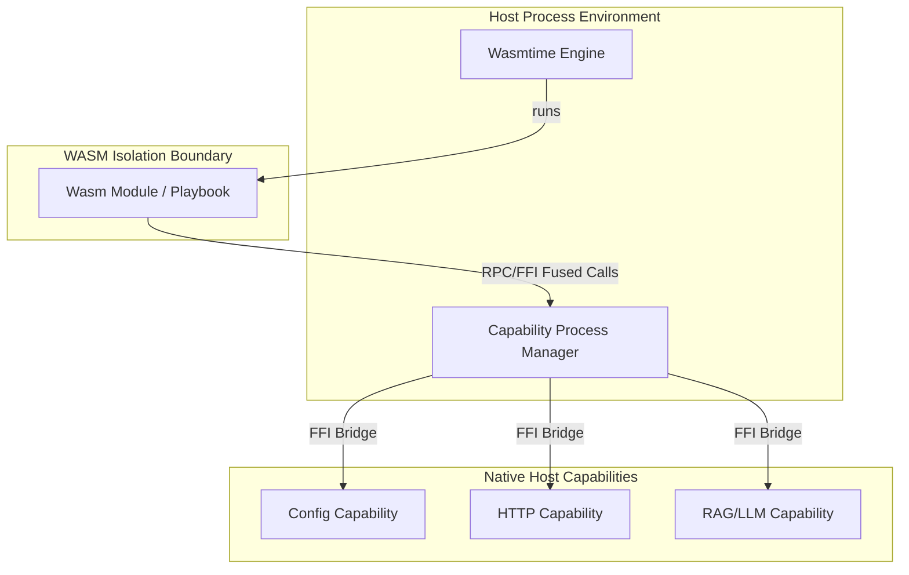

# Guide: Making Playbooks for Pyroduct Agents

Welcome to the **Pyroduct Playbook Guide**. This document defines the architecture, specifications, development workflow, and coding patterns for **Playbooks** (sandboxed WASM modules) within the Pyroduct ecosystem. 

This guide serves as a manual for developers and agents to build, configure, and code playbooks.

---

## Table of Contents
1. [Overview & Sandbox Architecture](#1-overview--sandbox-architecture)
2. [Playbook Project Structure](#2-playbook-project-structure)
3. [Manifest Specification (`Module.toml`)](#3-manifest-specification-moduletoml)
4. [Writing Playbook Logic in Rust](#4-writing-playbook-logic-in-rust)
   - [Declaring Inputs & Outputs](#declaring-inputs--outputs)
   - [Using Capabilities](#using-capabilities)
   - [Session-Based Playbooks (Stateful Conversations)](#session-based-playbooks-stateful-conversations)
   - [Inter-Playbook Communication & Chatbot Orchestration (Interconnect)](#inter-playbook-communication--chatbot-orchestration-interconnect)
5. [Building & Packaging Playbooks](#5-building--packaging-playbooks)
6. [Concrete Examples](#6-concrete-examples)

---

## 1. Overview & Sandbox Architecture

In Pyroduct, a **Playbook** is a sandboxed WebAssembly (WASM) module that defines a data-processing step. It communicates with the host environment using structured input/output rows (`PyroRow`) and requests native operations (like HTTP requests, database reads/writes, RAG models, or local state storage) via **Host Capabilities**.



### Key Architectural Concepts

*   **Isolated Sandbox:** Playbooks compile to target `wasm32-wasip1`. They cannot access the filesystem or network directly, ensuring safety.
*   **Structured Interface:** A playbook defines a single, typed entrypoint function marked with the `#[pyroduct::module]` macro. Input and output schemas are inferred or declared.
*   **Fused FFI/RPC Capabilities:** Whenever a playbook needs to perform operations like fetching URLs or querying state databases, it links with a host capability.

---

## 2. Playbook Project Structure

A typical playbook project is structured as a standalone Rust crate, managed by a custom manifest file:

```text
my_playbook/
├── Module.toml            # Pyroduct module manifest (defines metadata & capabilities)
├── src/
│   └── lib.rs             # Playbook entrypoint logic and capability calls
├── artifacts/             # Created during compilation
│   ├── mod.wasm           # Compiled sandboxed WASM binary
│   └── interface.json     # Extracted input/output schema specification
└── Cargo.toml             # Auto-generated by "pyroduct expand" (do not edit manually)
```

> [!WARNING]
> Do not modify `Cargo.toml` manually. Pyroduct uses `Module.toml` as the source of truth and generates/overwrites `Cargo.toml` automatically during the `pyroduct expand` phase.

---

## 3. Manifest Specification (`Module.toml`)

The [Module.toml](file:///Users/sven/nbhd/pyroduct/modules/basic/Module.toml) manifest tells the Pyroduct compiler how to construct the module, what capabilities it requires, and how those capabilities are configured.

### Schema Fields

| Table Section | Key | Type | Description |
| :--- | :--- | :--- | :--- |
| `[module]` | `package` | String | Unique identifier of the playbook. |
| | `version` | String | Semantic version of the playbook (e.g. `0.1.0`). |
| | `author` | String | Name or organization of the author. |
| `[pyroduct]` | `path` | String | Path to the local `pyroduct` engine library folder. |
| `[capabilities]` | `<cap_alias>` | Inline Table | Configuration structure for linked capabilities. |
| `[interconnect]` | `<playbook_alias>`| Inline Table | Dependencies on other playbooks (enables direct RPC calls). |
| `[dependencies]` | `<crate>` | String / Table | Standard Cargo dependencies needed by the WASM module. |

### Example Manifest

```toml
[module]
package = "customer_classifier"
version = "0.1.0"
author = "agent-alpha"

[pyroduct]
path = "../../lib/pyroduct/"

[capabilities]
# Link the 'config' capability and pre-configure it with target limits
config = { package = "config", author = "nbhdai", version = "0.1.0", configuration = { type = "capabilityconfig", classes = { transform = { uppercase = true } } } }

# Link standard http client capability
httpc = { package = "httpc", author = "nbhdai", version = "0.1.0" }

[interconnect]
# Enable this playbook to make direct RPC queries to the sentiment_analyzer playbook
sentiment = { package = "sentiment_analyzer", author = "nbhdai", version = "0.1.0" }

[dependencies]
serde = { version = "1.0", features = ["derive"] }
```

---

## 4. Writing Playbook Logic in Rust

Every playbook's entrypoint is declared using the `#[pyroduct::module]` attribute macro, applied to a function named `call` (or any custom identifier).

### Declaring Inputs & Outputs

The macro supports mapping outputs to named fields, tuples, or struct schemas:

*   **Named Scalar Output:** `#[pyroduct::module(output = result_message)]`
*   **Tuple Output:** `#[pyroduct::module(output = (original_text, length, is_valid))]`
*   **Direct Result Return:** The function must return a `Result<T, PyroError>`.

### Using Capabilities

To make requests to capabilities:
1.  Import the client representation (defined by the capability).
2.  Instantiate the capability client.
3.  Register the client instance (registers it across the WASM boundary to the host).
4.  Invoke registered methods.

```rust
use httpc::{HttpClient, HttpClientMethods};

#[pyroduct::module(output = response_body)]
fn call(target_url: &str) -> Result<String> {
    // 1. Initialize client
    let client = HttpClient.register()?;
    
    // 2. Perform native host HTTP request
    let response = client.get(target_url.to_string())?;
    
    Ok(response)
}
```

### Session-Based Playbooks (Stateful Conversations)

Pyroduct supports stateful, session-based playbooks. This is highly suitable for building chatbots, conversational agents, or multi-turn interactive workflows.

#### Enabling Sessions
To specify that a playbook operates within a session, pass the `session` attribute to the `#[pyroduct::module]` macro:
```rust
#[pyroduct::module(session, output = ChatMessage)]
```

#### Return Type
Session-based playbooks must return a `Result<SessionResponse<T>, PyroError>`. The `SessionResponse` enum is defined as:
```rust
pub enum SessionResponse<T> {
    Continue(T), // Continues the session and yields the output value
    End(T),      // Concludes the session normally and yields the final output value
    Terminate,   // Instantly terminates the session, yielding no output value (empty row)
}
```

#### Session Types & Input Patterns
Based on the function's parameter count, Pyroduct automatically compiles the playbook as either a flat **Session** or a split **SessionDiff**:

##### 1. Interleaved Session History (2 Inputs)
If the function takes exactly **2 inputs**, the first argument accepts a `Vec<T>` containing all prior inputs and outputs interleaved chronologically. The second argument accepts the current input:
```rust
#[pyroduct::module(session, output = ChatMessage)]
fn process(
    mut prior: Vec<ChatMessage>, // Interleaved history of prior turns (inputs & outputs)
    input: ChatMessage,          // Current user message
) -> Result<SessionResponse<ChatMessage>> {
    prior.push(input);
    // ... process prior history and input ...
    let reply = llm.chat(prior)?;
    Ok(SessionResponse::Continue(reply))
}
```
*Note: The history elements, input parameter, and the returned output value must all share the same type `T` (e.g. `ChatMessage`).*

##### 2. Split Session History (3 Inputs / SessionDiff)
If the function takes exactly **3 inputs**, Pyroduct separates the history lists. The first parameter receives all prior inputs, the second receives all prior outputs, and the third receives the current input:
```rust
#[pyroduct::module(session, output = message)]
fn process(
    prior_inputs: Vec<String>,   // History of user inputs
    prior_outputs: Vec<String>,  // History of assistant replies
    input: String,               // Current user message
) -> Result<SessionResponse<String>> {
    let turn = prior_outputs.len() + 1;
    // ... process split lists ...
    Ok(SessionResponse::Continue(format!("Replying to turn {}", turn)))
}
```

### Inter-Playbook Communication & Chatbot Orchestration (Interconnect)

Playbooks can invoke other playbooks directly by name. This enables orchestrating multi-agent networks, routers, and session-based chatbot workflows.

#### Stateless Interconnect Calls
To make a standard, stateless call to another playbook:
1. Declare the dependency in the `[interconnect]` section of `Module.toml`.
2. Invoke `pyroduct::call_playbook` with the playbook's alias and the input payload row.

```rust
use pyroduct::call_playbook;
use pyroduct::format::PyroRow;

#[pyroduct::module(output = sentiment)]
fn call(text: String) -> Result<String> {
    let target_input = PyroRow::from([("input", text.into())]);
    
    // Execute target playbook "sentiment"
    let (_session_id, target_output) = call_playbook("sentiment", &target_input)?;
    
    let sentiment = target_output.get_str("message")
        .unwrap_or("unknown")
        .to_string();
        
    Ok(sentiment)
}
```

#### Stateful Interconnect Session Calls
If the target playbook is a session-based chatbot, you must track and pass its `session_id` to maintain context over multiple turns:
1. **Initialize Session**: Call `call_playbook` with the target chatbot's alias and the initial user message. This starts a session, returning the initial chatbot reply and a unique `session_id`.
2. **Continue Session**: For subsequent turns, invoke `call_session` passing the chatbot's alias, the saved `session_id`, and the new user message. This ensures the target chatbot receives its correct historical state.

```rust
use pyroduct::{call_playbook, call_session, PyroRow};

#[pyroduct::module(output = chatbot_reply)]
fn orchestrate(user_msg: String, session_id_opt: Option<u64>) -> Result<String> {
    let input_row = PyroRow::from([
        ("role", "user".into()),
        ("content", user_msg.into()),
    ]);

    let (session_id, reply_row) = match session_id_opt {
        // Start a new chatbot session
        None => {
            let (sid, row) = call_playbook("chatbot", &input_row)?;
            (sid, row)
        }
        // Continue the existing chatbot session
        Some(sid) => {
            let row = call_session("chatbot", sid, &input_row)?;
            (sid, row)
        }
    };

    let reply = reply_row.get_str("content").unwrap_or("").to_string();
    Ok(reply)
}
```

---

## 5. Building & Packaging Playbooks

The Pyroduct CLI contains commands for initializing, developing, and packaging playbooks.

```bash
# 1. Initialize a new playbook project structure
pyroduct init my_playbook_folderCustom

# 2. Compile the module and place it in the cache for use by the daemon
pyroduct ship my_playbook_folder
```

For more details on CLI initialization, see [init.rs](file:///Users/sven/nbhd/pyroduct/lib/pyroduct/src/bin/cli/commands/init.rs).

---

## 6. Concrete Examples

### Example 1: Basic Math Playbook (No Capabilities)

#### `Module.toml`
```toml
[module]
package = "adder"
version = "0.1.0"
author = "agent-alpha"

[pyroduct]
path = "../../lib/pyroduct"

[capabilities]
[dependencies]
```

#### `src/lib.rs`
```rust
use pyroduct::module;

#[module(output = (sum, is_even))]
fn call(a: i64, b: i64) -> Result<(i64, bool)> {
    let sum = a + b;
    let is_even = sum % 2 == 0;
    Ok((sum, is_even))
}
```

---

### Example 2: Configuring Capabilities (Config Capability)

#### `Module.toml`
```toml
[module]
package = "text_transformer"
version = "0.1.0"
author = "agent-alpha"

[pyroduct]
path = "../../lib/pyroduct"

[capabilities]
config = { package = "config", author = "nbhdai", version = "0.1.0", configuration = { type = "capabilityconfig", classes = { transform = { uppercase = true, suffix = "!!!" } } } }

[dependencies]
```

#### `src/lib.rs`
```rust
use config::{TransformClient, TransformClientMethods};

#[pyroduct::module(output = (original, transformed))]
fn call(input: &str) -> Result<(String, String)> {
    // Instantiate client with a prefix
    let client = TransformClient {
        prefix: "[AGENT] ".to_string(),
    }.register()?;

    let original = input.to_string();
    // Host will automatically apply uppercase + suffix configuration rule
    let transformed = client.transform(input.to_string())?;

    Ok((original, transformed))
}
```

---

### Example 3: Full Interconnect Pipeline (Chaining 2 Playbooks)

Here, the `enricher` playbook calls out to the `database` playbook to gather data and appends it to the result.

#### `enricher` `Module.toml`
```toml
[module]
package = "enricher"
version = "0.1.0"
author = "agent-alpha"

[pyroduct]
path = "../../lib/pyroduct"

[capabilities]
[interconnect]
db = { package = "database_lookup", author = "agent-alpha", version = "0.1.0" }

[dependencies]
```

#### `enricher` `src/lib.rs`
```rust
use pyroduct::call_playbook;
use pyroduct::format::PyroRow;

#[pyroduct::module(output = (user_id, email, age))]
fn call(user_id: i64) -> Result<(i64, String, i64)> {
    // Query the database_lookup playbook
    let query = PyroRow::from([("user_id", user_id.into())]);
    let (_session_id, db_result) = call_playbook("db", &query)?;

    let email = db_result.get_str("email")
        .unwrap_or("unknown@domain.com")
        .to_string();
    let age = db_result.get_i64("age").unwrap_or(0);

    Ok((user_id, email, age))
}
```

---

### Example 4: Conversational Chatbot Playbook using LLM Capability

This example shows how to write a stateful chatbot playbook that maintains user conversation history and interacts with an LLM.

#### `Module.toml`
```toml
[module]
package = "chat"
version = "0.1.0"
author = "agent-alpha"

[pyroduct]
path = "../../lib/pyroduct"

[capabilities]
llm = { package = "llm", author = "nbhdai", version = "0.1.0" }

[dependencies]
```

#### `src/lib.rs`
```rust
use llm::{ChatMessage, LlmClient, LlmClientMethods};
use pyroduct::session::SessionResponse;

/// Processes multi-turn conversation and queries the LLM capability.
#[pyroduct::module(session, output = ChatMessage)]
fn process(
    mut prior: Vec<ChatMessage>,
    input: ChatMessage,
) -> Result<SessionResponse<ChatMessage>> {
    // 1. Register a client with the LLM capability
    let llm = LlmClient {
        model: "gemma-4-31B-it-Q8_0".to_string(),
        temperature: 0.7,
    }
    .register()?;

    // 2. Append the current turn input to the history
    prior.push(input);

    // 3. Query the capability with the complete interleaved history
    let reply = llm.chat(prior)?;

    // 4. End the session if the user says "goodbye"
    if reply.content.to_lowercase().contains("goodbye") {
        Ok(SessionResponse::End(reply))
    } else {
        Ok(SessionResponse::Continue(reply))
    }
}
```

---

### Additional References
*   [Capability Developer Guide](file:///Users/sven/nbhd/pyroduct/guide/CAPABILITY_GUIDE.md) - Instructions on creating capabilities.
*   [Core Error Guide](file:///Users/sven/nbhd/pyroduct/lib/pyroduct/errors.md) - Diagnostic reference for playbook execution failures.
*   [Codebase Main README](file:///Users/sven/nbhd/pyroduct/README.md) - CLI installation and engine overview.
